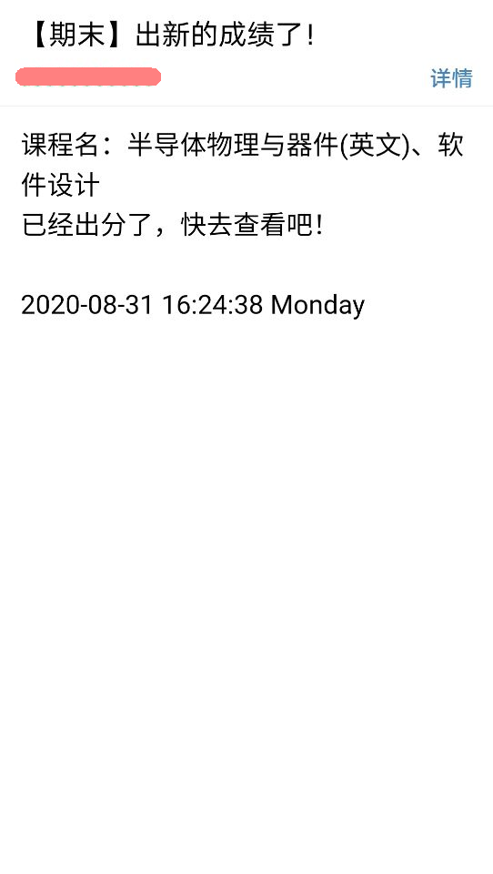

# Score-Notice
基于正方教务系统的期末考试成绩自动监控、邮件通知系统

## 更新信息
**2020-09-04更新**：修复了异常处理通知邮件的bug；更新了自述文件。

## 它是什么
这是为了解决能够随时知道什么时候期末考试出分了而实现的全自动化系统。程序是基于正方教务系统的，因此只有使用正方教务系统的学校才可以使用。

每隔一定的时间，监控正方系统有没有出新的成绩。如果有，利用smtp协议发送邮件进行通知。如果程序抛出异常，也将进行通知。

监控利用了[APScheduler](https://github.com/agronholm/apscheduler)的定时任务框架，推荐频率为5~10分钟。对于每次任务，采用[retry](https://github.com/invl/retry)模块进行异常重试处理。默认尝试10次，每次尝试间初始间隔5秒，之后以2倍的系数递增，但最长间隔不超过60秒。也就是说，装饰器的参数为：
```python
@retry(Exception, tries=10, delay=5, backoff=2, max_delay=60)
```

### 环境依赖
* Python 3.7.2环境开发
* Windows 10操作系统
* 依赖
  * [retry](https://github.com/invl/retry)
  * [School_Api](https://github.com/dairoot/school-api)
  * [APScheduler](https://github.com/agronholm/apscheduler)

非常感谢你们伟大的工作！！非常感谢！！

## 如何使用
利用git克隆该项目到本地：
```
git clone https://github.com/Pragmatism0220/Score-Notice.git
```
克隆之后，首先，在确保已经安装Python3的情况下，安装相应的依赖，使用命令
```
pip install -r requirements.txt
```
如果你的默认Python版本不是3的话，你应该使用`pip3`代替`pip`。

然后请配置`config.conf`（配置文件）。其格式如下：
```
[DEFAULT]
USERNAME = 正方账号
PASSWORD = 正方密码
ZHENGFANG_URL = 正方教务系统的登录网址
CURRENT_YEAR = 要监控的学年，如：2019-2020
CURRENT_TERM = 要监控的学期，如：2
FROM_ADDR = 发件邮箱
AUTH_CODE = 发件邮箱的授权码
TO_ADDR = 接收邮箱
SMTP_SERVER = smtp服务器地址，如：smtp.163.com
SEC_INTERVAL = 查询程序的频率（秒），如：300

[GROUP]
MEMBERS = 其他的同学的邮箱（不会显示你的成绩），用英文逗号隔开；若不需要则留空即可
```
之后，只需要挂在服务器（如VPS）上开一个`screen`，然后运行Main.py即可。
```
python Main.py
```
类似地，使用`python3`代替`python`如果你的默认Python版本不是3的话。

## 简单演示
发给本人的邮件通知效果展示：


发给同学的邮件通知效果展示：



## 作者
一个学生，一个宅男。

一个Kizuner，一个[春日望(twitter@kasuga_nozomi)](https://twitter.com/kasuga_nozomi)的死忠粉。

* **联系方式**
  * 博客：[Pragmatism0220的小窝](https://pragmatism0220.cf)
  * 电子邮件: pragmatism0220@gmail.com
  * 微博: [@保護者_Pragmatism0220](https://weibo.com/u/7341561133)
  * 推特: [@Pragmatism_0220](https://twitter.com/Pragmatism_0220)

## 开源许可证
[Mozilla Public License 2.0](https://github.com/Pragmatism0220/Score-Notice/blob/master/LICENSE)